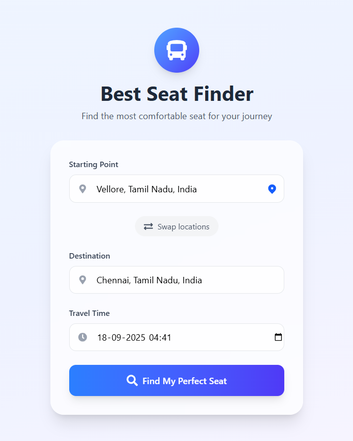
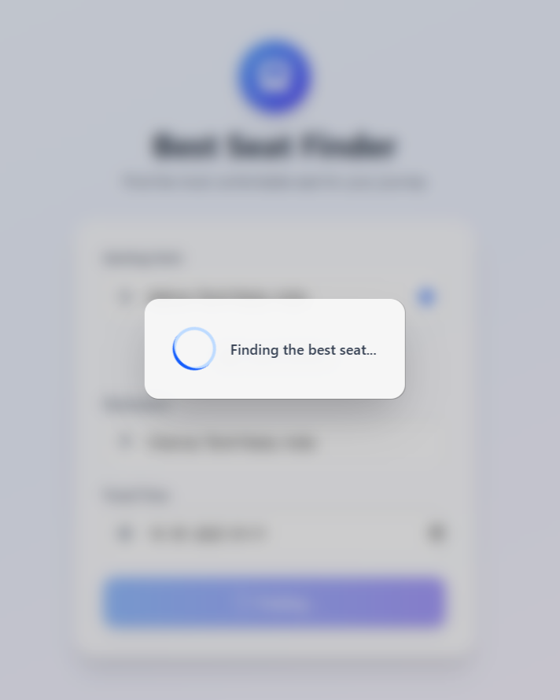
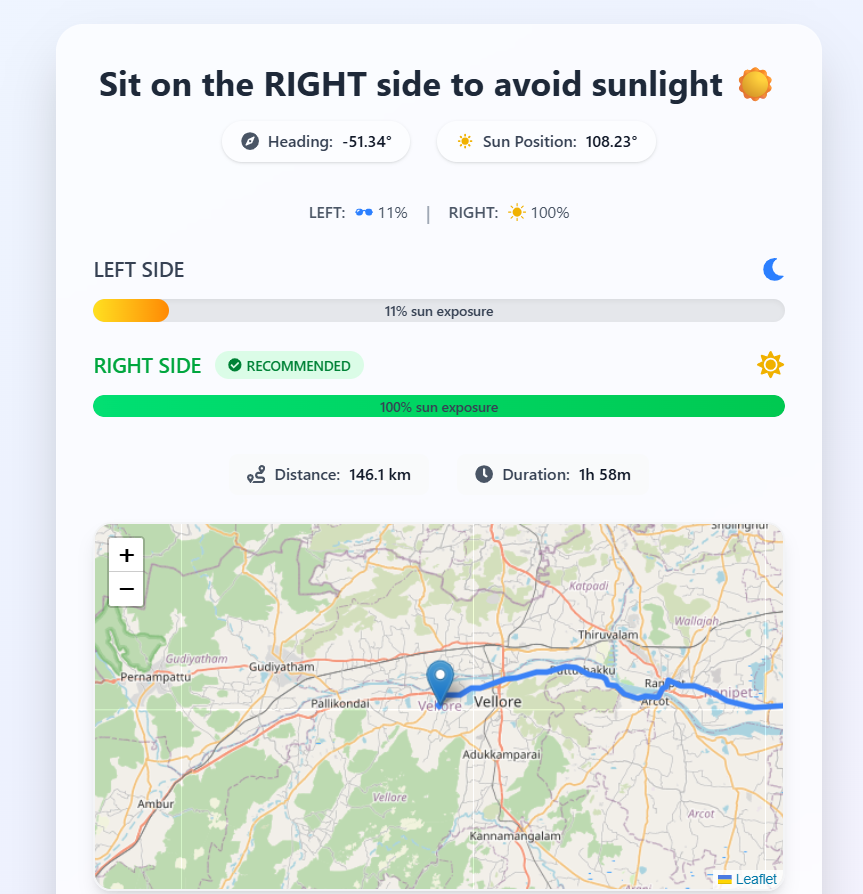

## 🚀 Features  

### 🏠 **Home Screen**  
- Clean, user-friendly interface built with **React** and **TailwindCSS**  
- Inputs for:  
  - **Start location** (with autocomplete suggestions)  
  - **Destination**  
  - **Travel time** (defaults to current time)  
- **Swap button** to reverse start ↔ destination instantly  
- **Use My Location** option to autofill starting point  

### 🔍 **Location Autocomplete**  
- Smart, backend-powered **autocomplete** for addresses and city names  
- Avoids spelling mistakes and ensures accurate place selection  
- Powered by **Nominatim / LocationIQ APIs** through the backend  

### 📍 **Current Location Detection**  
- Uses browser’s **Geolocation API** to detect exact coordinates  
- Reverse geocodes into a readable human address  
- Autofills into the **start input field** with one click  

### ⏳ **Loading State**  
- Full-screen loading overlay with spinner  
- Prevents duplicate submissions  
- Gives users feedback while seating recommendations are being calculated  

### 🌞 **Seat Recommendation**  
- Computes **bus heading** vs **sun azimuth** using **OSRM + SunCalc**  
- Suggests the **optimal side** (LEFT or RIGHT) to sit on  
- Special logic for **night time (when sun altitude ≤ 0)** →  
  - Returns *“Sit anywhere — no sunlight now”*  

### 📊 **Sun Exposure Percentages**  
- Shows calculated percentage of sunlight exposure for **LEFT** and **RIGHT** sides  
- **Progress bars** highlight which side is recommended  
- Example:  
  - LEFT: **72%** exposure → *Not ideal*  
  - RIGHT: **28%** exposure → *Recommended side*  

### 🗺 **Route & Trip Information**  
- Interactive **map view** built with React Leaflet + OpenStreetMap  
- Displays journey path (polyline)  
- **Markers** for start and end points with tooltips  
- Shows:  
  - **Total Distance (km)**  
  - **Estimated Travel Duration (hh:mm)**  

### 📱 **Mobile Friendly**  
- Fully responsive layout for phones, tablets, and desktops  
- Rounded inputs, larger buttons, and clean design for touch devices  

---

## 📷 Screenshots  

| **Home Screen** | **Loading State** | **Result Screen** |  
|-----------------|------------------|------------------|  
|  |  |  |  